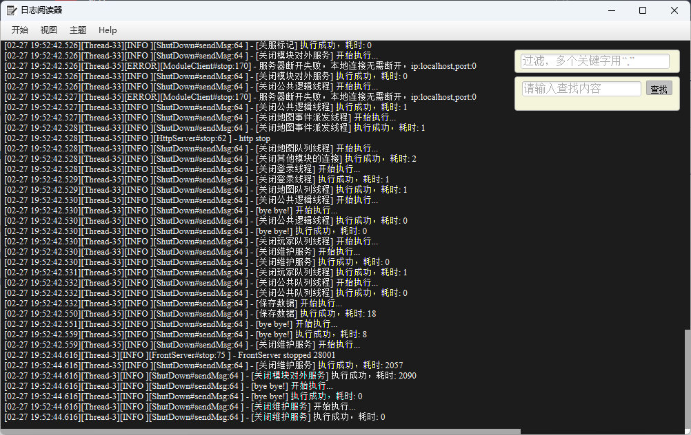

# tailfn

#### 介绍

类似于tail -300f 这样的命令查看文件更新内容，
日志文件阅读器

#### 软件架构

采用文件监听方式读取日志文件变更内容后显示最后变更的行数

相当于在linux 控制台输入 tail -150f xxx.log

软件首次运行会自动创建 view.yml 文件

配置文件格式：

| 名称          | 描述                     |
|-------------|------------------------|
| filePath    | 监听文件的路径，最好是全路径         |
| lastN       | 启动的同时显示最后多少行，默认为 150   |
| showMaxLine | 在滚动区域内显示的最大行数，默认1500   |
| autoWarp    | 在展示区域时是否自动换行，默认为 false |
| fontSize    | 字体大小，默认13号字体           |
| bgColor     | 主题模板，默认 body_light 浅色  |

#### 使用说明

右键打开查找功能，可以正常输入想要查找的内容

日志在查看的时候屏幕默认不滚动方便查看内容；如果日志太多滚动太快，可以点击右键暂停输出内容

右键打开过滤功能，可以在日志滚动的时候只查看带有关键字的行内容

### 预览

##### 浅色

##### 深色

